# Encrypted e-mail on Android #

Sending and receiving encrypted emails on Android isn't hard. Here's how to do
it!

## Download the applications  ##

First, we need to download two apps:

* [OpenKeychain](https://play.google.com/store/apps/details?id=org.sufficientlysecure.keychain), the app that does the actual encryption. Apart from the 
  set-up, it mostly works in the background.
* [K-9 Mail](https://play.google.com/store/apps/details?id=com.fsck.k9), an e-mail app that supports encryption.

Now launch K-9 mail.

##  Set-up email  ##

Simply enter your e-mail address and password, the rest should be done
automatically.

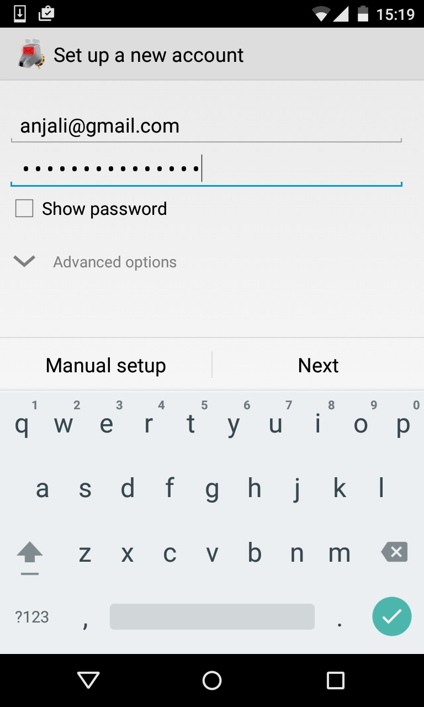

Potential problems: 

* [I am asked "What kind of account is this?"](#what_kind_of_account)
* [My gmail account has 2-step verification](#2FA)
* [I accidentally closed K-9 Mail while setting up](#wizard_is_dead)
* [I can't click "Next"](#next_is_grey)

Now we need to enable encryption in K-9 Mail. Tap on your account, then press
the menu icon  in the bottom right of the
screen. Select "Settings", then "Account settings". Scroll to the bottom of the
list and select "Cryptography". Touch "OpenPGP Provider" and select
"OpenKeychain" from the list.

## Set-up encryption  ##

First, we need to create a pair of keys. One key, called the secret key, will
let you decrypt messages sent to you, and the other one, called the public key,
will let people encrypt messages to you.

Launch OpenKeychain, then select "Create my key". Follow the steps on the
screen.

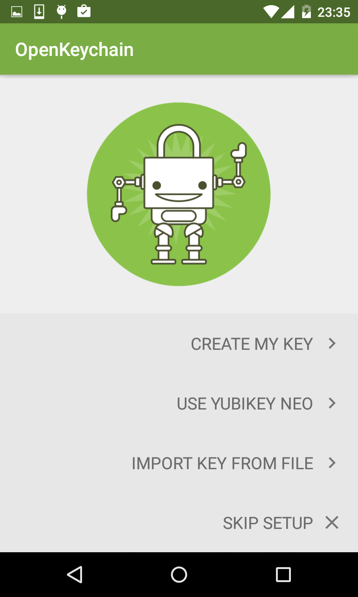

Make sure you choose a strong password. The password will encrypt the key which
you will use to decrypt your email. If your secret key were to fall in the
wrong hands, that password will stop them from reading all the messages you
sent.  But if you use a weak password, then they could find it by trying every
possible combination until they find the right one. Using software, this can be
done very quickly.

Don't forget this password, there is no way to reset it, as it is not stored
anywhere.

Once you've entered your information you will see this screen.

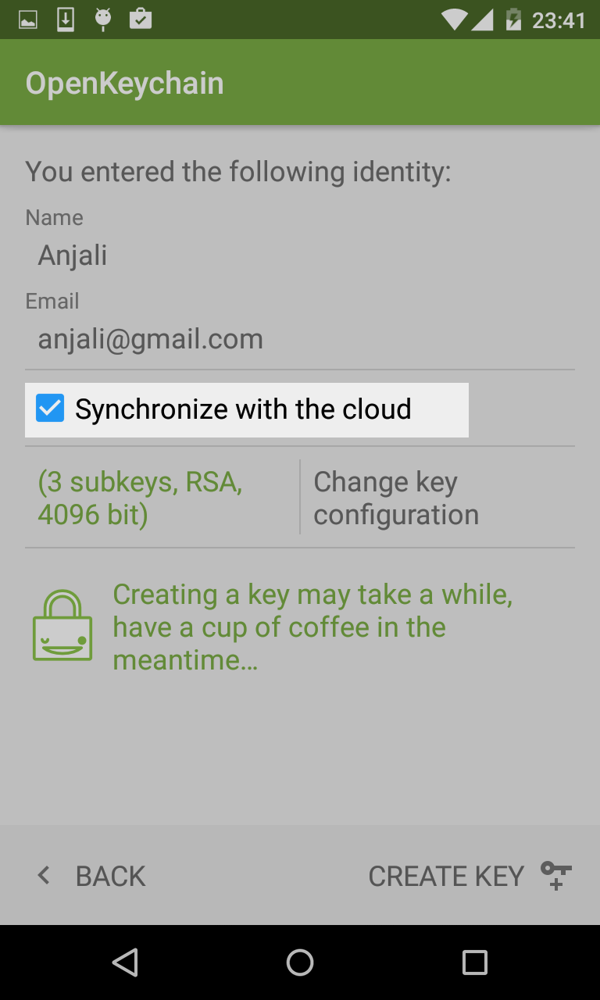

Important: If you do not uncheck "Synchronize with the cloud", then the fact
that you use email encryption will be made public. The advantage of
synchronizing with the cloud is that other people who use encryption will know
to send encrypted messages to you, and it will be much easier for them to do
so. However, even if you to not check this option, someone spying on your
messages will know that you use email encryption anyway.

## Exchanging keys ##

To send someone an encrypted email, you must first download their public key
into your keychain, and then verify that it is the correct key. The best way to
do that is to meet the person face-to-face. If the other person also uses
OpenKeychain and has internet access, you can use the following method.

If this method isn't suitable for you, here are some alternatives:

* [We don't have internet access](#key_exchange_nfc)
* [The other person doesn't use OpenKeychain](#key_exchange_email)

Press the share button  next to your key. The other person should do the same.

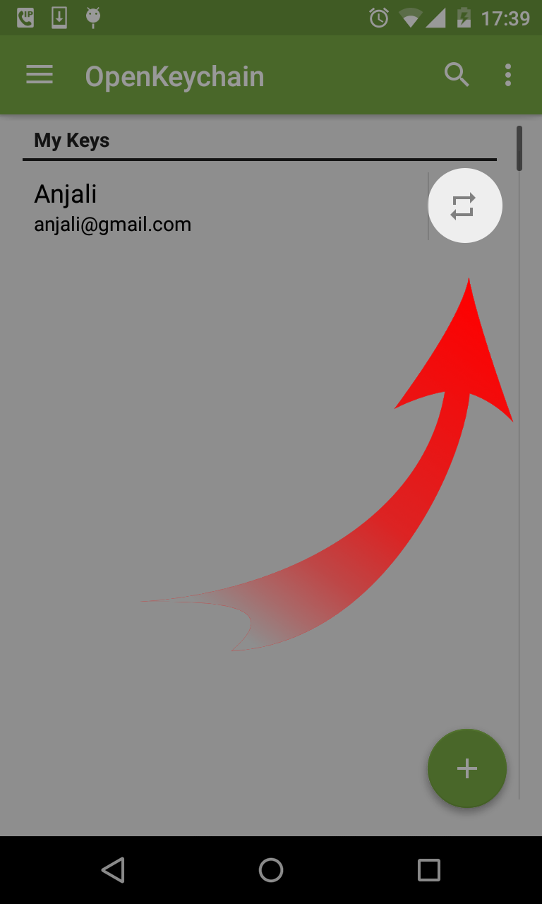

Follow the instructions on the screen. You'll be asked how many people are
exchanging keys, since this method lets multiple people exchange keys at the
same time. If it's just you and another person, you can touch "Start exchange".

In the next step,you'll want to put your phones side by side and see which
is the lowest number, then type that number in. 

In the last step, you'll be asked to verify that you have the right key by
picking the phrase that both your phones have in common

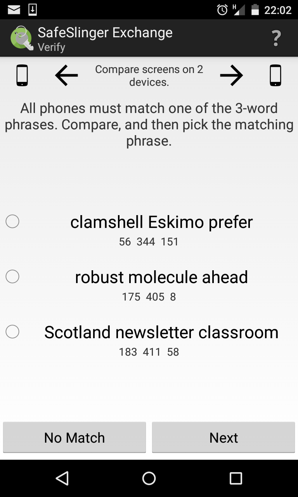

<!-- TODO: make it obvious with a screenshot of the other phone -->

If that works, [skip to the next step](#send_email). If it doesn't, try the method below.

### Exchange keys using NFC  ###

This method works if the person with whom you're trying to exchange keys has a
phone that supports NFC. You can check if your phone does by tapping your key,
then tapping the NFC icon .

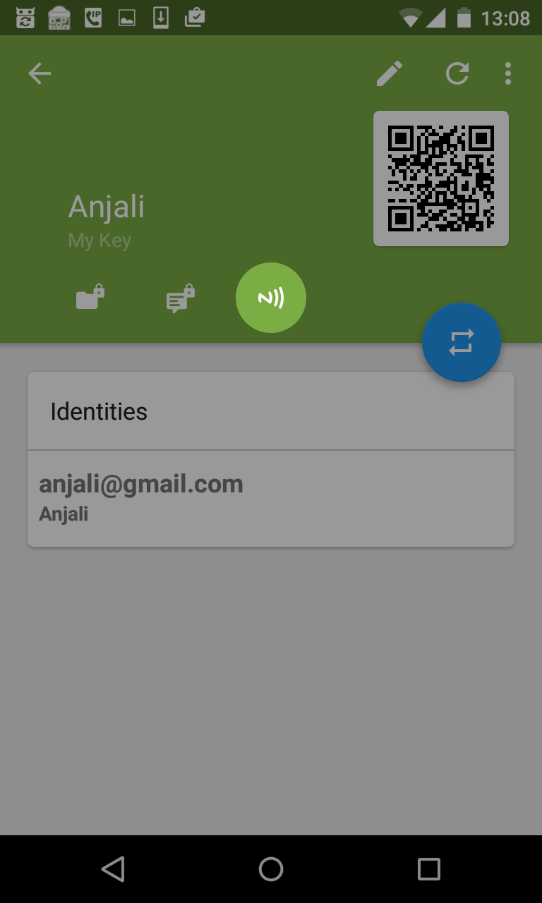

If you or the other person see the error "This device does not support NFC" at
the bottom of the screen, then [try the next method](#key_exchange_email). 

You might get an error message at the bottom of the screen telling you to
enable NFC or Android Beam. Tap the button to the right of that message to go
to the settings, where you can turn it on.

Once both your phones are ready to transmit, touch the back of the phones
together and hold them there for a few seconds. If nothing happens, try once
more in a different angle, again with the phones back to back.

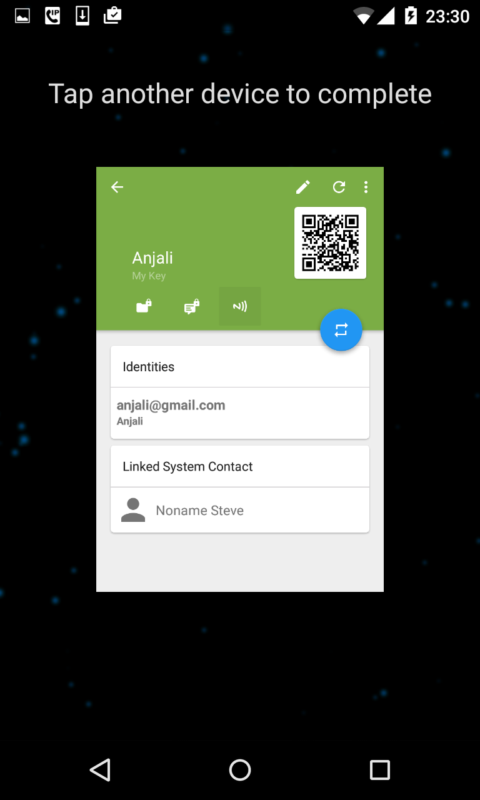

If that works, [head to the next step](#send_email). If you can't get NFC to
work, try the method below if you have synchronized your key with the cloud, or the [method after that](#key_exchange_email) if you haven't.

<!--TODO: How will they know if it worked? Is there a confirmation message or do they need to go through their key list?-->

### Download keys from the cloud ###

If you checked "Synchronize with the cloud" when creating your key, and have an
internet connection, you can exchange keys by scanning a QR code on each
other's phones. If you haven't already done so, tap on your key in the list of
keys, under "My Keys". Then tap on the QR code on the right side of the screen.

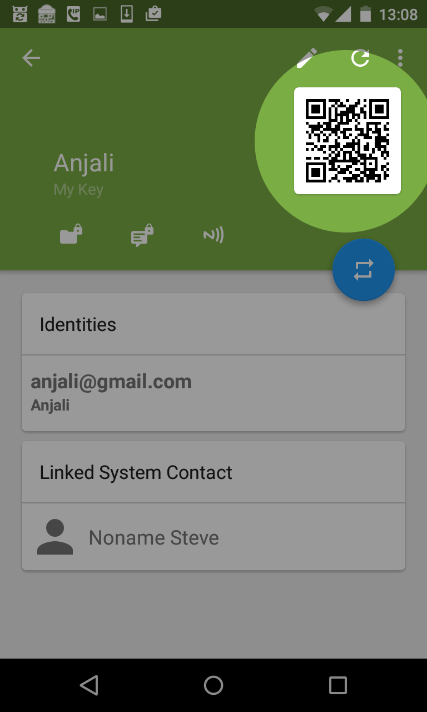

On the other phone, hit the plus button
 at the bottom right of the screen
and select "Scan QR Code". Then hold that phone in front of the QR code for a
few seconds. If nothing happens, turn up the brightness on the phone displaying
the QR code.

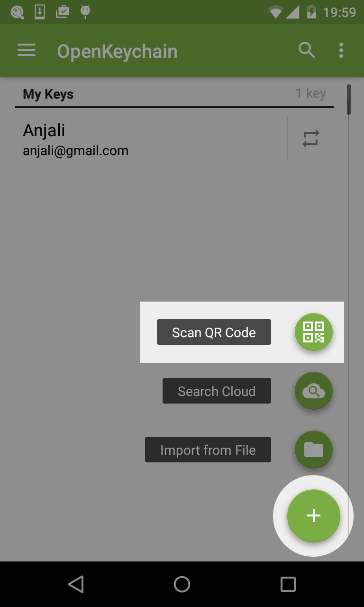

<!-- TODO: You need a section for signing the key, and links to this section-->

Now follow these steps again, but scan your phone this time. Once you're done,
[head to the next step](#send_email). If you can't get it to scan, try the
method below.

### Send keys by email ###

If your phone does not have NFC and you do not want to send your key to the
cloud, you can e-mail your keys to each other. This also works without an
internet connection, but you will have to write down the key fingerprint, which
is a series of numbers and letters used to verify that you have the right key,
and check it later.

Tap on your key, if you haven't done so already. Press the menu icon  in the top right of the screen. 

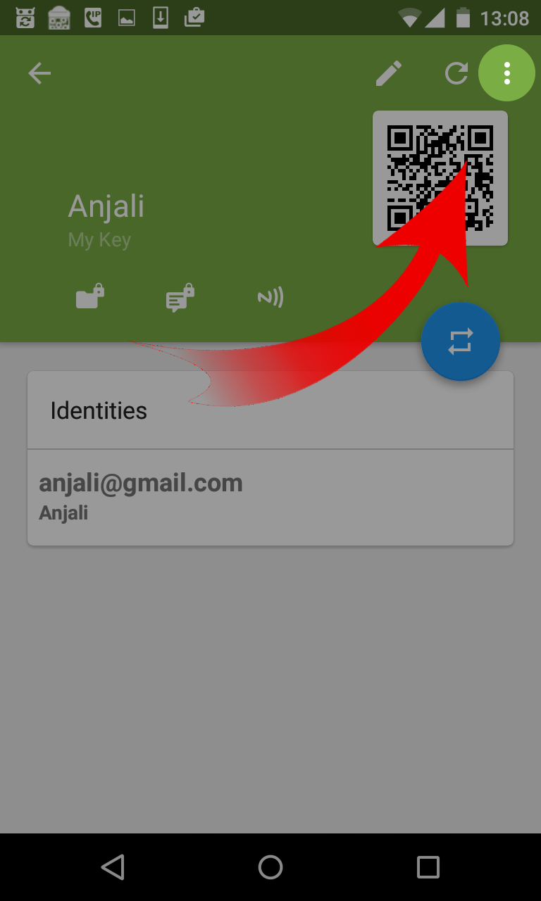

From the menu, select "Extended information". In the next screen, touch "share
with...", and select K-9 Mail from the list. You might have to scroll down to
find K-9 Mail. 

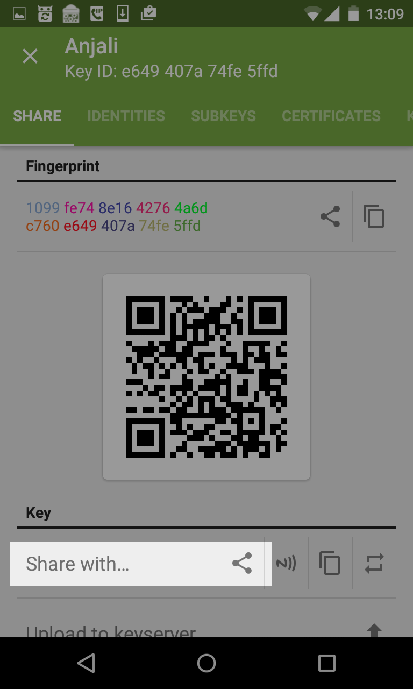

You'll now get the chance to send your first e-mail with K-9 Mail! Don't check
"encrypt" just now, since you don't have the other person's encryption key yet.

If you don't have an internet connection, you can still send the e-mail. It
will get sent once you're back online. 

One you've received the email, tap "Show attachments", and the open the
attachment with OpenKeychain.

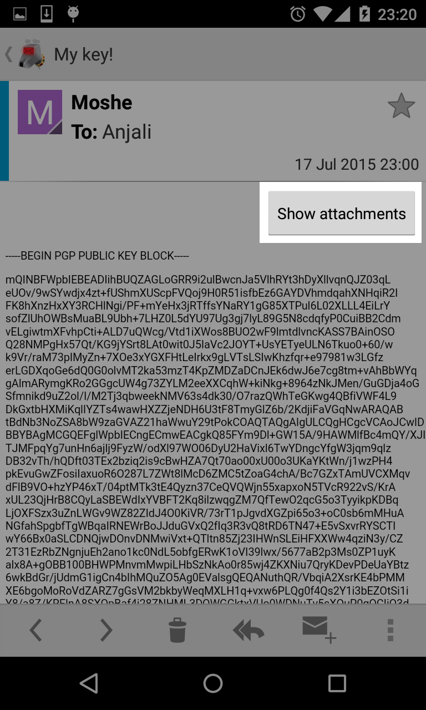

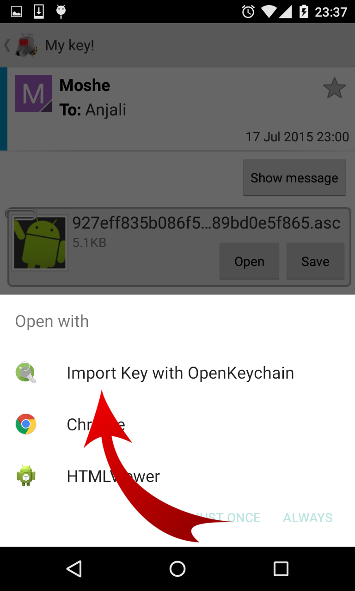

Tap "Import selected keys" at the bottom of the screen. Exit this screen, then
go back into OpenKeychain. <!-- This is very weird for the user: it looks like
they are in OpenKeychain, but they are actually in an OpenKeychain Intent
inside of K-9 mail. They need to go to the program list and into
OpenKeychain. How to explain this? -->

In OpenKeychain, go back to the main screen, where the list of keys is. Find
the key you just received by email and open it.

If you're not connected to the internet and received the key later, and the
other person is no longer next to you, [then proceed to the next
step](#key_exchange_email_manual_verification).

If the person who sent you the key is next to you, hit the blue button to
verify the key. The other person should tap on the QR code of their key. Scan
the QR code with your camera. If nothing happens, turn up the brightness on the
phone displaying the QR code.

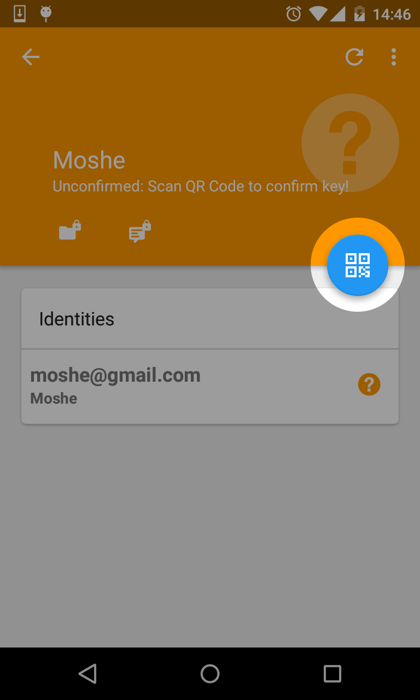

Once the other person has received your key, they should do the same.

You are now ready to send e-mail. [Proceed to the next step](#send_email).

If you are away from
the person who sent you the key, get the fingerprint you wrote down. On the
screen for their key, open the menu .

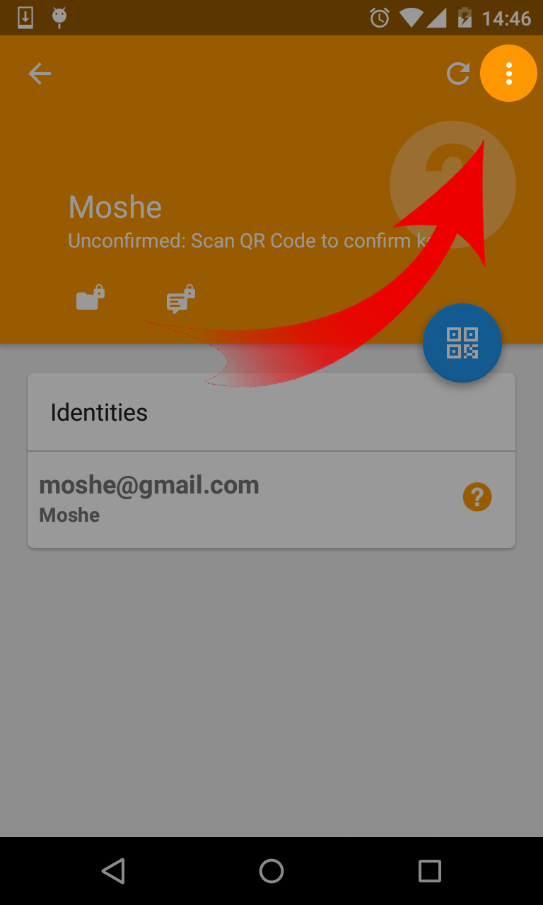

From that menu icon, select "Confirm via fingerprint comparison". If the
colourful letters and numbers on the screen match the ones you wrote down, then
tap "Fingerprints match".

## Send an e-mail ##

Open The K-9 Mail application, and tap the new message icon  on the bottom bar.

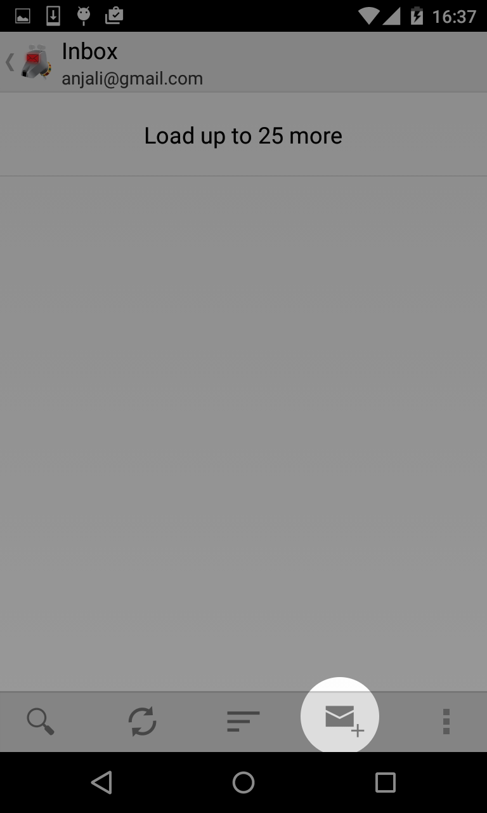

First, check the boxes "Sign" and "Encrypt", then compose your message as you
normally would.

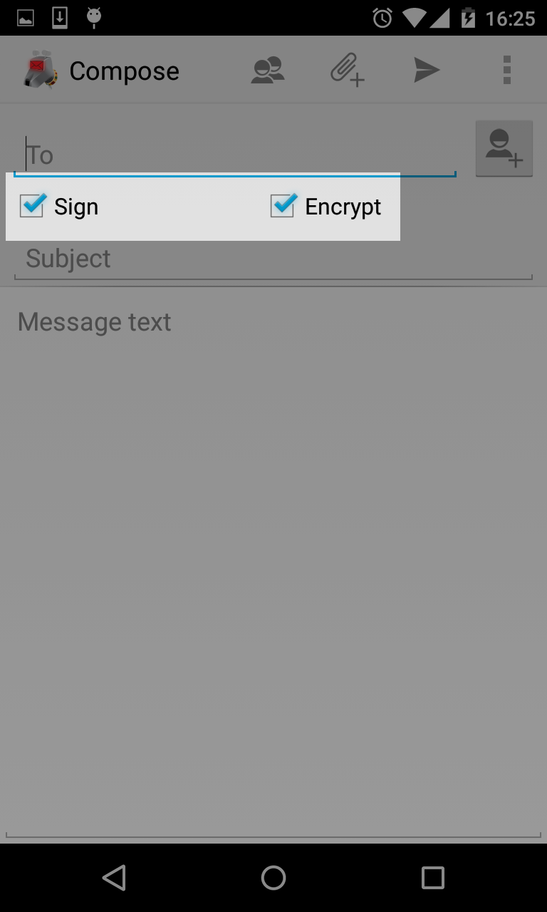

<!-- TODO: troubleshooting for when the checkboxes are missing -->

**That's it! You're done!**

## Troubleshooting ##

### Setting up K-9 mail ###

####  I am asked "What kind of account is this?" ####
The automated setup doesn't know about your email provider. Go in the help
section of your email provider and search for its "IMAP server settings". If
you find them, select "IMAP" in K-9 mail, and fill out the form with the 
information they provide.

If you can't find information on IMAP settings, then your email provider only
supports POP3. Search for your provider's POP3 settings.

[Back to guide](#email-problems)

####  My gmail account has 2-step verification ####

1. Visit your [App passwords](https://security.google.com/settings/security/apppasswords) page.
2. At the bottom, click *Select app* and choose "Other (Custom name)".
3. Click *Select device* and choose the device you’re using.
4. Select *Generate*.
5. Enter the App password (the 16 character code in the yellow bar) in the
   K-9 Mail set-up

TODO: show a screenshot with the error message caused by 2FA

[Back to guide](#email-problems)

####  I accidentally closed K-9 Mail while setting up ####

You'll have to delete the account you've started setting up. First, go to the
account list by pressing the left-pointing arrow in the top left corner of the
screen, next to the K-9 mascot. Press it a second time.

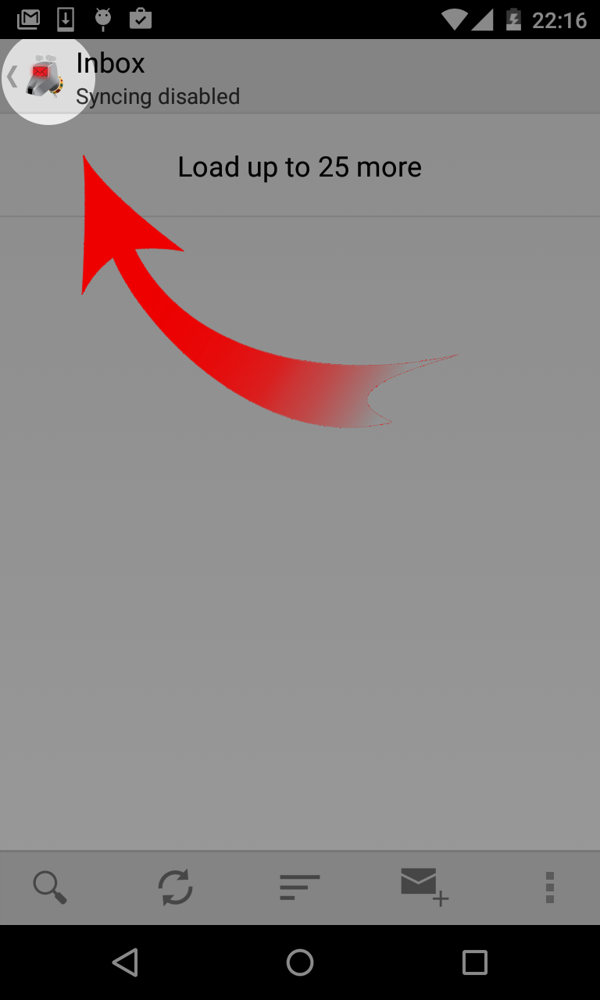

Touch on the account and hold  your finger on it. A menu will appear

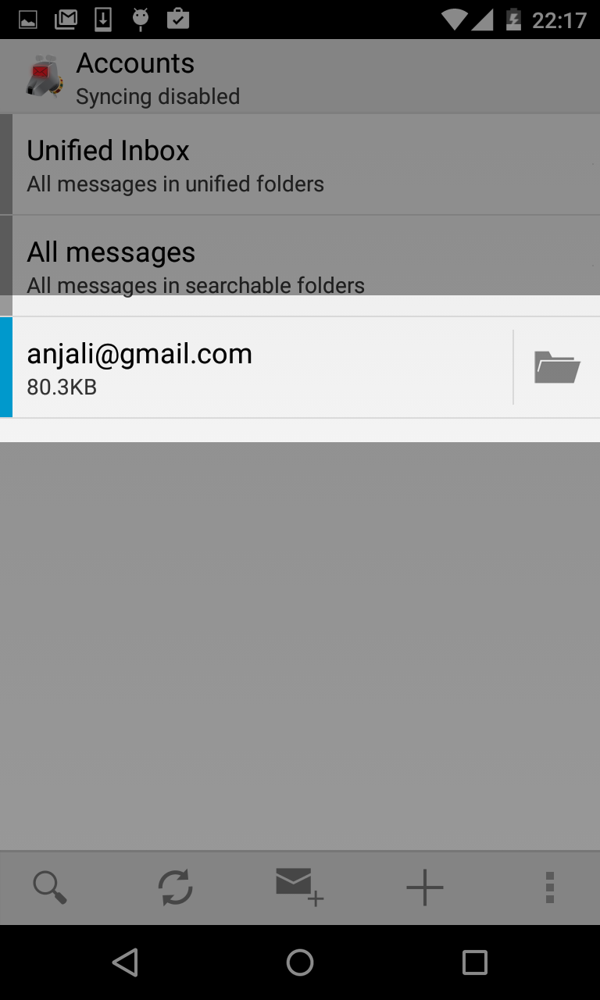

Touch "Remove account"

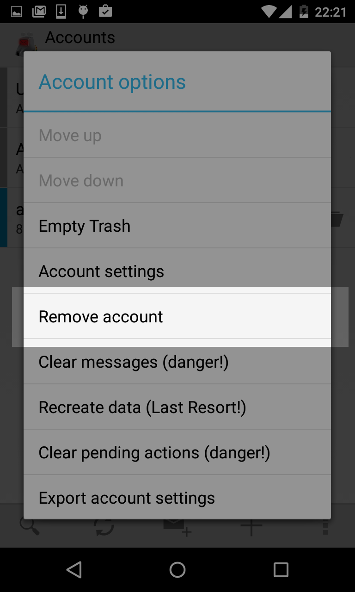

Now when you restart K-9 mail, the wizard will start again.

[Back to guide](#email-problems)

####  I can't click "Next" ####
Make sure you filled out both the address and password fields, and that the 
address is valid. Make sure there's no space at the end of the address.

[Back to guide](#email-problems)

## Feedback  ##

If a part of this guide was confusing, if you ran into problems that aren't in
the troubleshooting section, or if you you just want to drop me a line, my
email address is **philippe.latulippe at gmail.com**

I'd love to hear about your experiences while using this guide.

If you got far enough in the guide, you can even send me an encrypted e-mail!
Launch OpenKeychain, tap the plus button  in the bottom right corner of the screen, then tap "Search Cloud". From
there, you can search for my key by typing my e-mail address, or by copy and
pasting my key fingerprint, 0x12E9B4014345998C . You don't have to do this
though. You won't be able to verify that you are really using my key.

[Back to guide](#start)

## Contribute ##

[This guide is on GitHub](https://github.com/philippelatulippe/Encrypted-email-on-Android). Feel free to fork it, open issues or send patches.